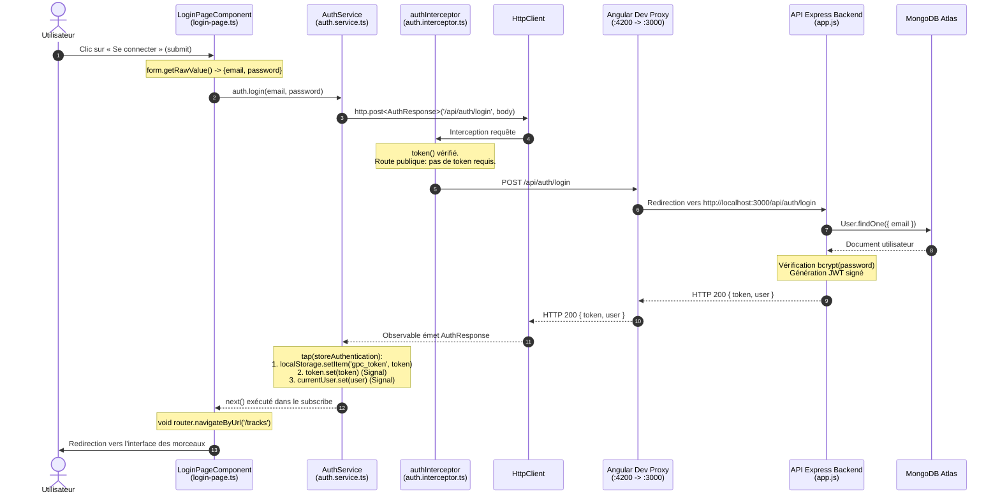

# Rapport d'usage de l'IA — TP1

## Informations générales
* **Binôme** : [Noms / Prénoms des étudiants]
* **Assistant IA utilisé** : Gemini 3.8 Flash (High) dans l'environnement Antigravity IDE
* **Mode d'utilisation** : Pair-programming pas-à-pas avec lecture du projet, proposition de diffs ciblés, validation humaine obligatoire avant application et contrôle par `npm run build`.

---

## Mission 0 — Cartographier l’application

### 1. Objectif
Comprendre l'architecture de départ sans modifier de code : identifier le composant racine, le routage, l'enregistrement de `HttpClient`, l'intercepteur JWT, les modèles et services, et produire le schéma de flux lors de la connexion ainsi que la distinction des routes publiques/protégées de l'API.

### 2. Prompt principal
> "Tu es mon assistant de développement pour ce projet AngularM1. Lis GEMINI.md, best-practices.md, README.md et API_CONTRACT.md. Analyse d'abord le code sans le modifier. Résume les fichiers concernés et le flux composant -> service -> HttpClient -> API. Indique les routes API et les modèles utilisés. Attends ma validation avant modification. Fais-moi Mission 0 Cartographier l'application."

### 3. Plan proposé par l'agent
1. Exploration de l'arborescence (`src/app/components`, `src/app/shared`).
2. Identification des points pivots : `main.ts`, `routes.ts`, `auth.interceptor.ts`, `auth.service.ts`.
3. Synthèse tabulaire des composants, services, modèles et guards.
4. Classification des routes de `API_CONTRACT.md` (publiques vs protégées par JWT).
5. Élaboration du diagramme de séquence Mermaid pour le clic sur « Se connecter ».

### 4. Vérifications réalisées par le binôme
* Contrôle manuel de `main.ts` pour confirmer la présence de `provideHttpClient(withInterceptors([authInterceptor]))`.
* Vérification de `proxy.conf.json` pour s'assurer que `/api` pointe vers `http://localhost:3000`.
* Test de santé de l'API backend : `curl http://localhost:3000/api/health` renvoyant `{"status":"ok"}`.
* Archivage de la synthèse dans le document de référence `TP1Mission0.md`.

### 5. Erreurs ou propositions rejetées
* Aucune modification de code effectuée conformément à la règle stricte d'observation préalable.

### 6. Fichiers consultés (aucun fichier modifié)
* `frontend-starter/src/main.ts`
* `frontend-starter/src/app/routes.ts`
* `frontend-starter/src/app/shared/interceptors/auth.interceptor.ts`
* `frontend-starter/src/app/shared/services/auth.service.ts`
* `frontend-starter/src/app/shared/services/track.service.ts`
* `frontend-starter/src/app/shared/models/*`
* `API_CONTRACT.md`, `README.md`, `backend/src/app.js`

### 7. Preuve de fonctionnement et cartographie détaillée

#### A. Cartographie de l’architecture frontend
| Élément | Emplacement & Description |
| :--- | :--- |
| **Composant racine** | `AppComponent` (`app-root`), défini avec son template `app.html` et son style `app.css`. Il contient l’en-tête commun et le `<router-outlet />`. Démarré dans `main.ts`. |
| **Configuration des routes** | `routes` : fourni au bootstrap via `provideRouter(routes)` dans `main.ts`. Définit `/login`, `/register`, `/profile` (gardé), `/tracks` (gardé) et une redirection par défaut vers `/tracks`. |
| **Enregistrement de HttpClient** | Configuré dans `main.ts` avec : `provideHttpClient(withInterceptors([authInterceptor]))` |
| **Mécanisme d’injection du JWT** | `authInterceptor` : intercepteur fonctionnel (`HttpInterceptorFn`) qui injecte `AuthService`, lit le signal `token()` et clone la requête avec l’en-tête `Authorization: Bearer <token>` si un token est présent. |

#### B. Pages, Services, Modèles et Guards
* **Pages (Composants) :**
  * `LoginPageComponent` : formulaire de connexion réactif.
  * `RegisterPageComponent` : formulaire d'inscription.
  * `ProfilePageComponent` : affichage et modification du profil.
  * `TracksPageComponent` : liste paginée, upload et lecture audio.
* **Services :**
  * `AuthService` : gère `login()`, `register()`, `profile()`, `update()`, `logout()`, et détient les signals `currentUser` et `token`.
  * `TrackService` : encapsule les appels HTTP pour les pistes (`list()`, `upload()`, `audio()`).
* **Modèles :**
  * `User` (`id`, `name`, `email`, `createdAt`)
  * `AuthResponse` (`token`, `user`)
  * `Track` (`id`, `title`, `originalName`, `mimeType`, `size`, `createdAt`)
  * `Page` (`items`, `page`, `limit`, `total`, `pages`)
* **Guard :**
  * `authGuard` : vérifie `auth.token()` avant d’activer `/profile` ou `/tracks`, sinon redirige vers `/login`.

#### C. Routes API : Publiques vs Protégées (`API_CONTRACT.md`)
Toutes les requêtes sont préfixées par `/api` (redirigées vers le backend via `proxy.conf.json`).

| Statut | Méthode | Route | Corps / Paramètres | Réponse | Modèle associé |
| :--- | :--- | :--- | :--- | :--- | :--- |
| **Publique** | `GET` | `/api/health` | Aucun | `{ status: "ok" }` | — |
| **Publique** | `POST` | `/api/auth/register` | `{ name, email, password }` | `201 { token, user }` | `AuthResponse` |
| **Publique** | `POST` | `/api/auth/login` | `{ email, password }` | `200 { token, user }` | `AuthResponse` |
| **Protégée (JWT)** | `GET` | `/api/users/me` | Aucun *(Header Authorization)* | `200 User` | `User` |
| **Protégée (JWT)** | `PUT` | `/api/users/me` | `{ name }` + Header *Authorization* | `200 User` | `User` |
| **Protégée (JWT)** | `GET` | `/api/tracks` | Query: `?page=1&limit=5` + Header *Authorization* | `200 Page<Track>` | `Page` |
| **Protégée (JWT)** | `POST` | `/api/tracks` | Multipart : `audio`, `title` + Header *Authorization* | `201 Track` | `Track` |
| **Protégée (JWT)** | `GET` | `/api/tracks/:id/audio` | Header *Authorization* | Flux audio (`Blob`) | `Blob` |
| **Protégée (JWT)** | `DELETE` | `/api/tracks/:id` | Header *Authorization* | `204 No Content` | — |

#### D. Schéma annoté du flux lors du clic sur « Se connecter »

### 8. Ce que chaque membre sait expliquer sans l'agent
* Le trajet d'une requête HTTP depuis le composant Angular jusqu'à MongoDB via le service, `HttpClient`, l'intercepteur et le proxy.
* La différence entre route publique (`/api/auth/login`, `/api/auth/register`, `/api/health`) et route protégée par `Authorization: Bearer <token>` (`/api/users/me`, `/api/tracks`).

---

## Mission 1 — Inscription, Connexion et Profil

### 1. Objectif
Compléter la partie utilisateur du frontend :
* Formulaires réactifs pour la connexion et l'inscription avec validations et messages compréhensibles.
* Traitement des appels API, stockage sécurisé du token dans `localStorage` et mise à jour des Signals `token` et `currentUser`.
* Bouton de déconnexion réactif dans le header avec nettoyage complet de l'état local.
* Chargement automatique du profil (`GET /api/users/me`) et mise à jour réactive du nom (`PUT /api/users/me`).
* Gestion globale du statut HTTP `401 Unauthorized` pour rediriger vers `/login` sans fuite de token.

### 2. Prompts principaux
* *"On va aller pas à pas pour la mission 1 on va commencer par ce tiret : formulaires réactifs pour l'inscription et la connexion ; et explique-moi comment t'as fait"*
* *"Validations et messages d'erreur compréhensibles"*
* *"Appels de /api/auth/register et /api/auth/login, sauvegarde du JWT sans fuite dans les logs, mise à jour du Signal currentUser, redirection"*
* *"Bouton de déconnexion avec nettoyage de l'état local"*
* *"Chargement de /api/users/me et modification du nom avec PUT /api/users/me"*
* *"Gestion d'un 401, avec retour vers /login si le token est invalide ou expiré"*

### 3. Plan proposé par l'agent et exécuté pas à pas
1. **Formulaires réactifs** :
   * Typage strict `nonNullable: true` sur les `FormControl`.
   * Validateur `Validators.minLength(8)` sur le mot de passe à l'inscription pour respecter les exigences du backend (`app.js:169`).
   * Garde-fou `if (this.form.invalid) return;` avant toute émission réseau.
2. **Messages d'erreur explicites & Accessibilité** :
   * Conditionnement des messages par `@if (form.controls.<champ>.touched && form.controls.<champ>.errors?.['...'])`.
   * Déclenchement de `markAllAsTouched()` si soumission d'un formulaire incomplet.
   * Ajout des attributs `role="alert"` et `autocomplete` (WCAG AA).
3. **Flux d'authentification** :
   * Exploitation de `tap` dans `AuthService` pour alimenter `localStorage` et les Signals.
   * Redirection via `Router.navigateByUrl`.
4. **Bouton de déconnexion** :
   * Transformation du header de `AppComponent` en barre de navigation conditionnelle réactive (`@if (auth.token())`).
   * Suppression de `gpc_token` et réinitialisation des Signals à `null` lors de `logout()`.
5. **Profil utilisateur** :
   * Appel automatique de `load()` dans le constructeur de `ProfilePageComponent`.
   * Validation du nouveau nom et retours visuels (message de succès et gestion des erreurs).
6. **Gestion globale du 401** :
   * Ajout de `catchError` dans `authInterceptor`.
   * Exclusion de la route `/api/auth/login` pour ne pas masquer les erreurs de saisie d'identifiants.

### 4. Vérifications réalisées par le binôme
* **Build Angular** : exécuté systématiquement après chaque incrément (`npm run build` terminé à chaque fois avec succès en ~1.3s).
* **Onglet Network (DevTools)** :
  1. `POST /api/auth/login` avec identifiants valides (`demo@example.com` / `Demo1234!`) -> Statut `200 OK`, token reçu, redirection `/tracks`.
  2. `POST /api/auth/login` avec mauvais mot de passe -> Statut `401 Unauthorized`, message d'erreur rouge affiché sans redirection intempestive.
  3. `GET /api/users/me` -> Statut `200 OK` avec en-tête `Authorization: Bearer <token>`, chargement automatique des informations.
  4. `PUT /api/users/me` -> Statut `200 OK`, mise à jour immédiate du nom dans l'UI.
* **Onglet Application (DevTools)** :
  * Présence de `gpc_token` lors de la connexion.
  * Disparition immédiate de `gpc_token` au clic sur « Déconnexion ».

### 5. Erreurs ou propositions adaptées
* **Ciblage de l'intercepteur 401** : Initialement, intercepter tous les 401 risquait d'interférer avec le formulaire de login (qui renvoie 401 en cas de mot de passe erroné). Nous avons adapté la condition pour exclure `request.url.includes('/auth/login')`. Ainsi, la tentative de connexion erronée reste gérée localement par le formulaire de connexion, tandis que l'expiration du token sur les routes protégées redirige bien l'utilisateur.

### 6. Fichiers effectivement modifiés
* `frontend-starter/src/app/components/login-page/login-page.ts` : validation submit et `markAllAsTouched`.
* `frontend-starter/src/app/components/login-page/login-page.html` : messages d'erreur ciblés et désactivation bouton.
* `frontend-starter/src/app/components/register-page/register-page.ts` : validateur 8 caractères et `markAllAsTouched`.
* `frontend-starter/src/app/components/register-page/register-page.html` : messages d'erreur ciblés et bouton lié à `form.invalid`.
* `frontend-starter/src/app/components/app/app.ts` : injection `AuthService` et méthode `logout()`.
* `frontend-starter/src/app/components/app/app.html` : affichage conditionnel `@if (auth.token())` et bouton déconnexion.
* `frontend-starter/src/app/components/app/app.css` : styles pour `.btn-logout` et alignement de la navigation.
* `frontend-starter/src/app/components/profile-page/profile-page.ts` : chargement automatique `load()`, signaux `loading`, `success`, `error`.
* `frontend-starter/src/app/components/profile-page/profile-page.html` : formulaire réactif complet, feedback d'enregistrement.
* `frontend-starter/src/app/components/profile-page/profile-page.css` : style `.success`.
* `frontend-starter/src/app/shared/interceptors/auth.interceptor.ts` : gestion centralisée du statut 401 avec déconnexion et redirection.

### 7. Preuve de fonctionnement
* Compilation sans avertissement : `npm run build` (gpc bundle 298 kB).
* Scénario complet testé avec succès dans le navigateur : Inscription d'un nouveau compte -> Redirection profil -> Modification du nom -> Consultation des backing tracks -> Déconnexion -> Tentative d'accès direct à `/tracks` bloquée par `authGuard`.

### 8. Ce que chaque membre sait maintenant expliquer sans l'agent
1. **Différence entre Signal et `localStorage`** :
   * Le `Signal` est réactif et réside en mémoire vive (RAM). Dès qu'il est mis à jour (`set`), les composants et templates qui le lisent se réaffichent immédiatement. Mais il est volatile (perdu au rafraîchissement F5).
   * Le `localStorage` est un stockage persistant sur disque (clé/valeur sous forme de chaîne). Il survit au rafraîchissement de la page, mais n'est pas réactif (sa modification ne déclenche aucun cycle de détection Angular).
   * D'où leur association : `localStorage` conserve le token entre les sessions, et le Signal `token` propage son état réactivement dans l'application.
2. **Localisation de la mise à jour du profil utilisateur** :
   * Côté Front : [ProfilePageComponent](frontend-starter/src/app/components/profile-page/profile-page.ts) (formulaire réactif) -> [AuthService.update()](frontend-starter/src/app/shared/services/auth.service.ts) -> [authInterceptor](frontend-starter/src/app/shared/interceptors/auth.interceptor.ts) (ajoute le token Bearer).
   * Côté Back : [backend/src/app.js](backend/src/app.js) (`app.put("/api/users/me", auth, ...)`) -> middleware `auth` (vérification JWT) -> [User.findByIdAndUpdate()](backend/src/models/User.js) (sauvegarde dans MongoDB Atlas).
