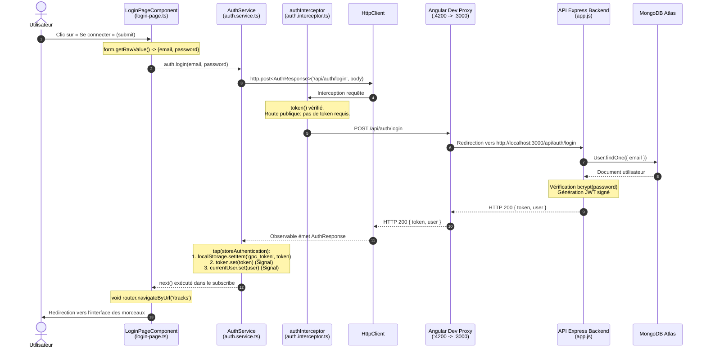

# Mission 0 — Cartographier l’application

## 1. Cartographie de l’architecture frontend

### Structure générale

| Élément | Emplacement & Description |
| :--- | :--- |
| **Composant racine** | `AppComponent` (`app-root`), défini avec son template `app.html` et son style `app.css`. Il contient l’en-tête commun et le `<router-outlet />`. Démarré dans `main.ts`. |
| **Configuration des routes** | `routes` : fourni au bootstrap via `provideRouter(routes)` dans `main.ts`. Définit `/login`, `/register`, `/profile` (gardé), `/tracks` (gardé) et une redirection par défaut vers `/tracks`. |
| **Enregistrement de HttpClient** | Configuré dans `main.ts` avec : `provideHttpClient(withInterceptors([authInterceptor]))` |
| **Mécanisme d’injection du JWT** | `authInterceptor` : intercepteur fonctionnel (`HttpInterceptorFn`) qui injecte `AuthService`, lit le signal `token()` et clone la requête avec l’en-tête `Authorization: Bearer <token>` si un token est présent. |

### Pages, Services, Modèles et Guards

* **Pages (Composants) :**
  * `LoginPageComponent` : formulaire de connexion réactif.
  * `RegisterPageComponent` : formulaire d'inscription.
  * `ProfilePageComponent` : affichage et modification du profil.
  * `TracksPageComponent` : liste paginée, upload et lecture audio.
* **Services :**
  * `AuthService` : gère `login()`, `register()`, `profile()`, `update()`, `logout()`, et détient les signals `currentUser` et `token`.
  * `TrackService` : encapsule les appels HTTP pour les pistes (`list()`, `upload()`, `audio()`).
* **Modèles :**
  * `User` (`id`, `name`, `email`, `createdAt`)
  * `AuthResponse` (`token`, `user`)
  * `Track` (`id`, `title`, `originalName`, `mimeType`, `size`, `createdAt`)
  * `Page` (`items`, `page`, `limit`, `total`, `pages`)
* **Guard :**
  * `authGuard` : vérifie `auth.token()` avant d’activer `/profile` ou `/tracks`, sinon redirige vers `/login`.

---

## 2. Routes API : Publiques vs Protégées (`API_CONTRACT.md`)

Toutes les requêtes sont préfixées par `/api` (redirigées vers le backend via `proxy.conf.json`).

| Statut | Méthode | Route | Corps / Paramètres | Réponse | Modèle associé |
| :--- | :--- | :--- | :--- | :--- | :--- |
| **Publique** | `GET` | `/api/health` | Aucun | `{ status: "ok" }` | — |
| **Publique** | `POST` | `/api/auth/register` | `{ name, email, password }` | `201 { token, user }` | `AuthResponse` |
| **Publique** | `POST` | `/api/auth/login` | `{ email, password }` | `200 { token, user }` | `AuthResponse` |
| **Protégée (JWT)** | `GET` | `/api/users/me` | Aucun *(Header Authorization)* | `200 User` | `User` |
| **Protégée (JWT)** | `PUT` | `/api/users/me` | `{ name }` + Header *Authorization* | `200 User` | `User` |
| **Protégée (JWT)** | `GET` | `/api/tracks` | Query: `?page=1&limit=5` + Header *Authorization* | `200 Page<Track>` | `Page` |
| **Protégée (JWT)** | `POST` | `/api/tracks` | Multipart : `audio`, `title` + Header *Authorization* | `201 Track` | `Track` |
| **Protégée (JWT)** | `GET` | `/api/tracks/:id/audio` | Header *Authorization* | Flux audio (`Blob`) | `Blob` |
| **Protégée (JWT)** | `DELETE` | `/api/tracks/:id` | Header *Authorization* | `204 No Content` | — |

---

## 3. Schéma annoté du flux lors du clic sur « Se connecter »

